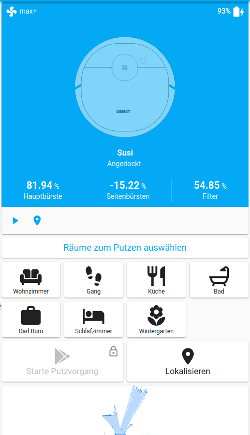

# UI advanced example

Main feature is ability to specify via UI the order of the cleaned rooms.
Thanks to @aidbish for the initial idea.



## Setup

For this setup to work, you need some custom components (all available via HACS)

- [Variables](https://github.com/Wibias/hass-variables)
- [Vacuum-card](https://github.com/denysdovhan/vacuum-card)
- [Button-card](https://github.com/custom-cards/button-card)

## Configuration

Below you can find the snippets for this example including the backend configuration.
Adjust it for your needs.

!!! todo

    Please change the of the entities accordingly, *most* lines are anotated with "change me".
    My vacuum has the name _"susi"_.

## Backend (configuration.yaml)

```yaml
script:
  deebot_clean:
    description: Start a deebot cleaning task
    variables:
      queue: variable.deebot_susi_queue # change me
      vacuum_bot: vacuum.susi # change me
    sequence:
      - alias: Get room numbers
        variables:
          # See for appending to list
          # https://github.com/home-assistant/core/issues/33678#issuecomment-609424851
          rooms: >-
            
            
            
            
              
            
            {{ data.rooms | join(",") }}
      - alias: Send cleaning job to vacuum
        service: vacuum.send_command
        data:
          entity_id: "{{ vacuum_bot }}"
          command: spot_area
          params:
            rooms: "{{ rooms }}"
            cleanings: 1

  deebot_room_queue:
    description: Add/Remove a room from the queue
    fields:
      queue:
        description: The queue variable
        example: deebot_susi_queue
      room:
        description: Room, which should be removed or added
        example: kitchen
    sequence:
      - service: variable.set_variable
        data:
          variable: "{{ queue }}"
          value: >-
            
            
            
              {{ room }}
            
              {{ queue_split | reject("eq", room) | list | join(",")}}
            
              {{ (queue_split + [room]) | join(",") }}
            

recorder:
  exclude:
    entities:
      - variable.deebot_susi_queue # change me
      - script.deebot_room_queue
    entity_globs:
      - sensor.deebot_*_queue_*

variable:
  deebot_susi_queue: # change me
    name: Susi Raum Reihenfolge # change me
    value: ""
    restore: false

# Room name comes from the integration to match attribute names
template:
  unique_id: deebot_susi_queue # change me
  trigger:
    - platform: homeassistant
      event: start
    - platform: state
      entity_id: variable.deebot_susi_queue # change me
  sensor:
    # Add for each room the following. Change room_name accordingly
    - unique_id: deebot_susi_queue_living_room # change me
      name: deebot_susi_queue_living_room # change me
      # room_name must match the room name provided by the vacuum
      state: >
        
        
        {{ queue.index(room_name)+1 if room_name in queue else 0 }}
```

### UI configuration

In the UI we use button card templates to reduce duplicate code. More information can be found in their [documentation](https://github.com/custom-cards/button-card#Configuration-Templates).

```yaml
button_card_templates:
  vacuum_service:
    color: var(--text-color)
    entity: vacuum.susi # change me
    tap_action:
      action: call-service
      service_data:
        entity_id: vacuum.susi # change me
    lock:
      enabled: |
        [[[ return variables.enabled ]]]
      exemptions: []
    styles:
      card:
        - height: 80px
      lock:
        - color: var(--primary-text-color)
    state:
      - operator: template
        value: |
          [[[ return variables.enabled ]]]
        styles:
          card:
            - color: var(--disabled-text-color)
  vacuum_room:
    color: var(--text-color)
    variables:
      # change me
      lock_enabled: >
        [[[ return ['cleaning', 'paused'].includes(states['vacuum.susi'].state)
        ]]]
    state:
      - operator: template
        value: |
          [[[ return variables.lock_enabled && entity.state == 0 ]]]
        styles:
          card:
            - color: var(--disabled-text-color)
      - styles:
          card:
            - background-color: var(--primary-color)
        operator: ">="
        value: 1
    styles:
      card:
        - font-size: 12px
      grid:
        - position: relative
      custom_fields:
        order:
          - display: |
              [[[
                if (entity.state == "0")
                  return "none";
                return "block";
              ]]]
          - position: absolute
          - left: 5%
          - top: 5%
          - height: 20px
          - width: 20px
          - font-size: 20px
          - font-weight: bold
          - line-height: 20px
    custom_fields:
      order: |
        [[[ return entity.state ]]]
    tap_action:
      action: call-service
      service: script.deebot_room_queue
      service_data:
        queue: deebot_susi_queue # change me
    lock:
      enabled: |
        [[[ return variables.lock_enabled ]]]
      exemptions: []
```

Below the actual card configuration

```yaml
type: vertical-stack
cards:
  - type: custom:vacuum-card
    entity: vacuum.susi # change me
    stats:
      default:
        - entity_id: sensor.susi_life_span_brush # change me
          unit: "%"
          subtitle: Hauptbürste
        - entity_id: sensor.susi_life_span_side_brush # change me
          unit: "%"
          subtitle: Seitenbürsten
        - entity_id: sensor.susi_life_span_filter # change me
          unit: "%"
          subtitle: Filter
      cleaning:
        - entity_id: sensor.susi_stats_area # change me
          unit: m²
          subtitle: Geputzte Fläche
        - entity_id: sensor.susi_stats_time # change me
          unit: Minuten
          subtitle: Reinigungsdauer
    show_status: true
    show_toolbar: false
    compact_view: true
  - type: custom:button-card
    color: auto-no-temperature
    name: Räume zum Putzen auswählen
    styles:
      card:
        - font-size: 18px
        - height: 30px
      name:
        - color: var(--primary-color)
  - type: horizontal-stack
    cards:
      # Add the following chard for each room. Change values accordingly
      - type: custom:button-card
        template: vacuum_room
        entity: sensor.deebot_susi_queue_living_room # change me
        icon: mdi:sofa
        name: Wohnzimmer
        tap_action:
          service_data:
            room: living_room # change me

  - type: horizontal-stack
    cards:
      - type: conditional
        conditions:
          - entity: vacuum.susi # change me
            state_not: cleaning
          - entity: vacuum.susi # change me
            state_not: paused
        card:
          type: custom:button-card
          template: vacuum_service
          icon: mdi:play
          name: Start
          tap_action:
            action: call-service
            service: script.deebot_clean
          variables:
            # change me
            enabled: |
              [[[ 
                return ((!states['variable.deebot_susi_queue'].state || 
                    states['variable.deebot_susi_queue'].state.length === 0)
                    && ['docked', 'idle', 'error', 'returning'].includes(entity.state))
              ]]]
      - type: conditional
        conditions:
          - entity: vacuum.susi # change me
            state: cleaning
        card:
          type: custom:button-card
          color: auto
          icon: mdi:pause
          name: Pause
          tap_action:
            action: call-service
            service: vacuum.pause
            service_data:
              entity_id: vacuum.susi # change me
          styles:
            card:
              - height: 80px
              - background-color: var(-color)
      - type: conditional
        conditions:
          - entity: vacuum.susi # change me
            state: paused
        card:
          type: custom:button-card
          color: auto
          icon: mdi:play-pause
          name: Weiter
          tap_action:
            action: call-service
            service: vacuum.start
            service_data:
              entity_id: vacuum.susi # change me
          styles:
            card:
              - height: 80px
              - background-color: var(-color)
      - type: custom:button-card
        template: vacuum_service
        icon: mdi:stop
        name: Stop
        tap_action:
          service: vacuum.stop
        variables:
          enabled: |
            [[[ 
              return !(['cleaning', 'paused', 'returning'].includes(entity.state))
            ]]]
  - type: horizontal-stack
    cards:
      - type: custom:button-card
        template: vacuum_service
        icon: mdi:home-map-marker
        name: Zurück zur Ladestation
        tap_action:
          service: vacuum.return_to_base
        variables:
          enabled: |
            [[[ 
              return ['docked', 'returning'].includes(entity.state)
            ]]]
      - type: custom:button-card
        color: auto
        icon: mdi:map-marker
        name: Lokalisieren
        tap_action:
          action: call-service
          service: vacuum.locate
          service_data:
            entity_id: vacuum.susi # change me
        styles:
          card:
            - height: 80px
            - background-color: var(-color)
  - type: picture-entity
    entity: camera.susi_live_map # change me
    tap_action:
      action: none
    hold_action:
      action: none
    show_state: false
    show_name: false
```
