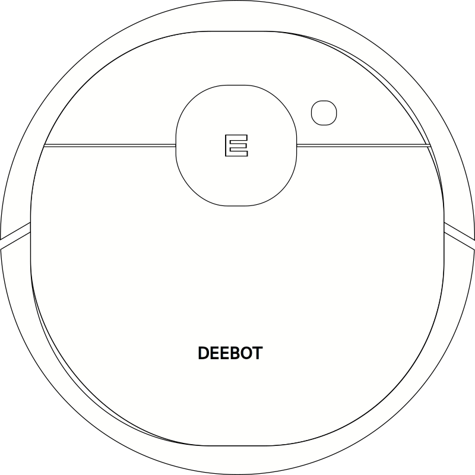

# Misc

The following svg of the Deebot Ozmo 950 can be found under [images](../../assets/images/deebot950.svg).

{: style="height:100px"}

## Custom commands

It's also possible to send commands, which are not supported yet by this integration.
For that use also the `vacuum.send_command` service and you will get the response as `deebot_custom_command` event.

!!! tip

    The interesting part is normally inside `response->body->data`.
    In the example below it means I have enabled the advanced mode.

??? example "Example with the command `getAdvancedMode`"

    ```yaml
    service: vacuum.send_command
    target:
      entity_id: vacuum.YOUR_ROBOT_NAME
    data:
      command: getAdvancedMode
    ```

    When calling the above example you will get the event `deebot_custom_command` similar to:

    ```json
    {
      "event_type": "deebot_custom_command",
      "data": {
        "name": "getAdvancedMode",
        "response": {
          "header": {
            "pri": 1,
            "tzm": 480,
            "ts": "1295442034442",
            "ver": "0.0.1",
            "fwVer": "1.8.2",
            "hwVer": "0.1.1"
          },
          "body": {
            "code": 0,
            "msg": "ok",
            "data": {
              "enable": 1
            }
          }
        }
      },
      "origin": "LOCAL",
      "time_fired": "2021-10-05T21:45:40.294958+00:00",
      "context": {
        "id": "[REMOVED]",
        "parent_id": null,
        "user_id": null
      }
    }
    ```
